# DMI_Practica_03

# Práctica de Programación en Dart

## Portada
**Carrera**: Desarrollo de Software Multiplataforma  
**Asignatura**: Desarrollo Móvil Integral  
**Profesor**: Marco Antonio Ramírez Hernández  
**Estudiante**: Raúl Reyes Batalla – 220217  
**Fecha**: 28/09/2025

---

## Objetivo General
Fortalecer los conocimientos básicos y avanzados del lenguaje de programación **Dart**, comprendiendo el uso de variables, estructuras de datos, funciones, clases, constructores, herencia, mixins y programación orientada a objetos mediante ejercicios prácticos.

---

## Ejercicios

### 📝 01_hello_world_220217.dart
**Objetivo**  
Comprender la estructura básica de un programa en Dart y realizar la impresión en consola.

**Desarrollo**  
Este código imprime un mensaje simple en pantalla y sirve como introducción al lenguaje Dart, probando la correcta configuración del entorno.

**Evidencia**  
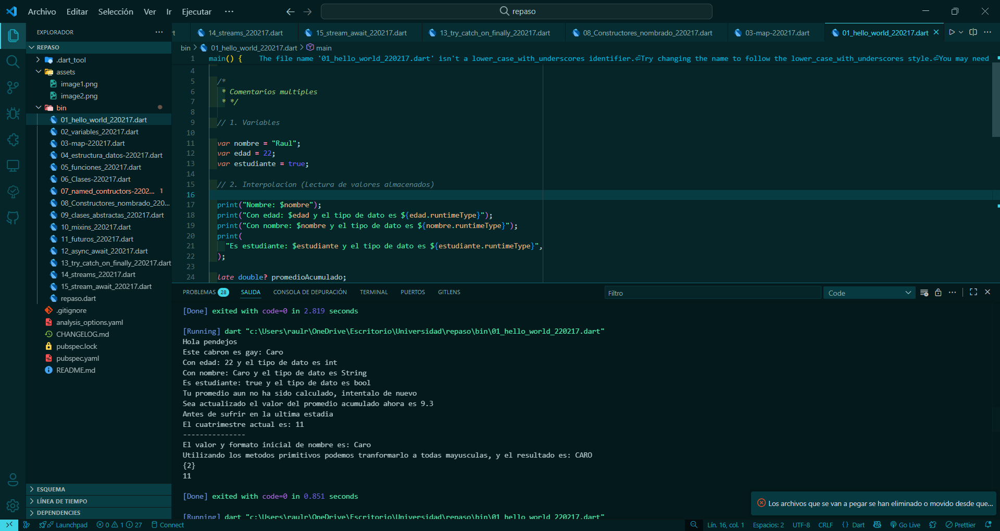

**Conclusión**  
El primer ejercicio permitió entender la sintaxis mínima necesaria para ejecutar un programa en Dart.

---

### 📝 02_variables_220217.dart
**Objetivo**  
Practicar la declaración e impresión de variables de diferentes tipos en Dart.

**Desarrollo**  
Se muestran variables de tipo `String`, `int`, `bool` y se imprime su valor, aplicando interpolación de cadenas.

**Evidencia**  
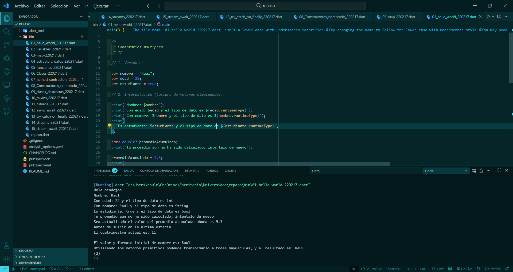

**Conclusión**  
Fue posible reconocer cómo Dart maneja tipos de datos y cómo se puede trabajar con ellos fácilmente.

---

### 📝 03-map-220217.dart
**Objetivo**  
Comprender el uso de la estructura de datos `Map` en Dart.

**Desarrollo**  
Se declara un `Map` con pares clave-valor, se agregan elementos y se imprimen, mostrando cómo acceder a la información.

**Evidencia**  
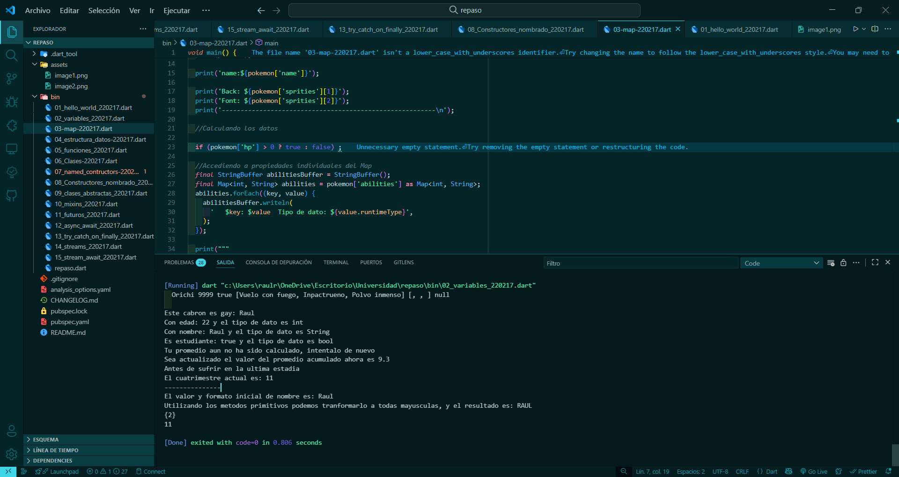

**Conclusión**  
Este ejercicio facilitó la comprensión del manejo de datos mediante estructuras asociativas.

---

### 📝 04_estructura_datos-220217.dart
**Objetivo**  
Explorar las estructuras de datos principales de Dart (`List`, `Set`, `Map`).

**Desarrollo**  
Se crean listas y conjuntos, mostrando cómo añadir, eliminar y recorrer sus elementos.

**Evidencia**  
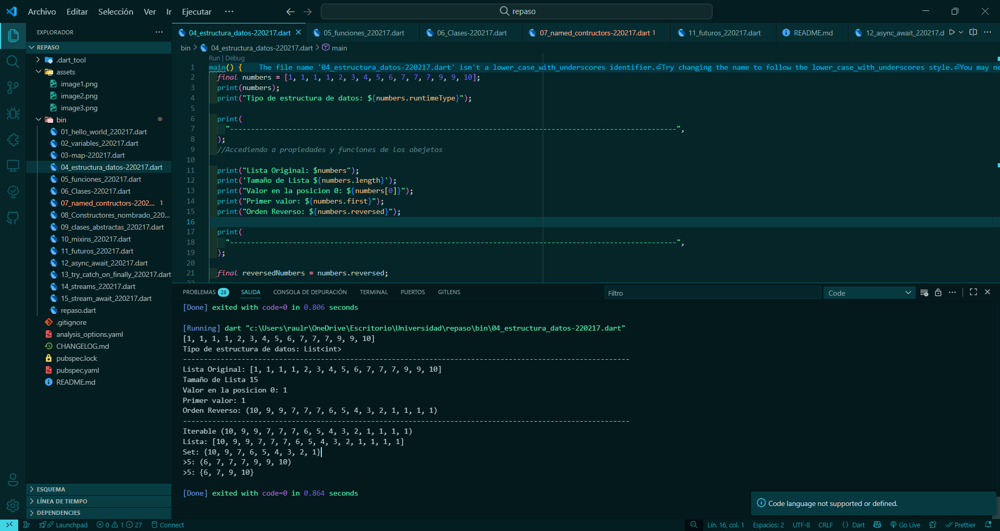

**Conclusión**  
El ejercicio sirvió para conocer la versatilidad de Dart en el manejo de colecciones.

---

### 📝 05_funciones_220217.dart
**Objetivo**  
Comprender la declaración y uso de funciones en Dart.

**Desarrollo**  
Se implementan funciones con parámetros, valores de retorno y parámetros opcionales.

**Evidencia**  
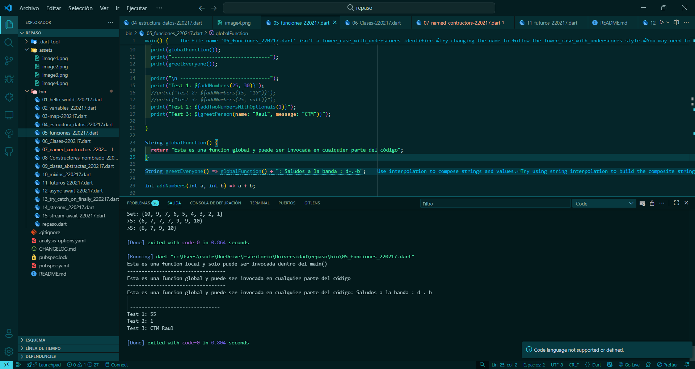

**Conclusión**  
El ejercicio ayudó a diferenciar funciones con y sin parámetros, además de practicar la reutilización de código.

---

### 📝 06_Clases-220217.dart
**Objetivo**  
Introducir el concepto de clases y objetos en Dart.

**Desarrollo**  
Se define una clase con atributos y métodos, y se crean instancias para demostrar su funcionamiento.

**Evidencia**  
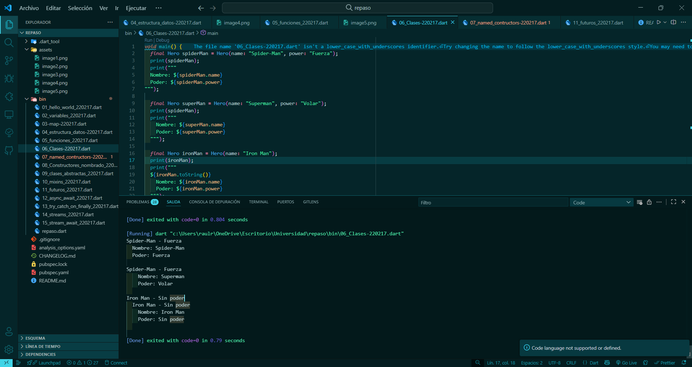

**Conclusión**  
Se comprendió cómo crear objetos y aplicar el paradigma de la Programación Orientada a Objetos.

---

### 📝 07_named_contructors-220217.dart
**Objetivo**  
Utilizar constructores nombrados en Dart.

**Desarrollo**  
Se crean constructores alternativos que permiten inicializar objetos de diferentes formas.

**Evidencia**  
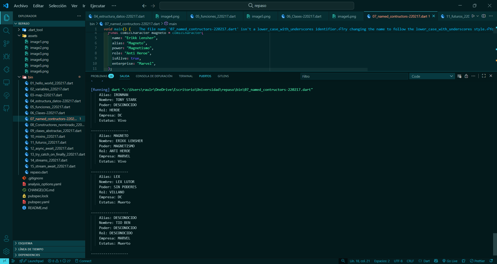

**Conclusión**  
El ejercicio mostró la utilidad de los constructores nombrados para dar flexibilidad en la creación de instancias.

---

### 📝 08_Constructores_nombrado_220217.dart
**Objetivo**  
Profundizar en el uso de constructores nombrados y su aplicación.

**Desarrollo**  
Se define un constructor nombrado adicional que inicializa con valores predeterminados.

**Evidencia**  
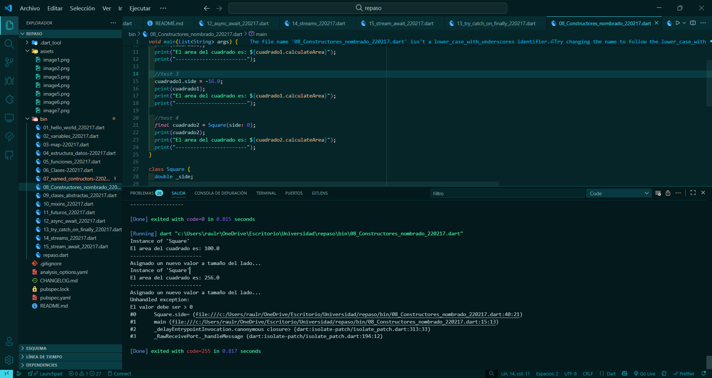

**Conclusión**  
Ayudó a reforzar cómo un objeto puede construirse con diferentes escenarios de inicialización.

---

### 📝 09_clases_abstractas_220217.dart
**Objetivo**  
Comprender el uso de clases abstractas y herencia en Dart.

**Desarrollo**  
Se crea una clase abstracta con métodos que deben ser implementados por las subclases.

**Evidencia**  
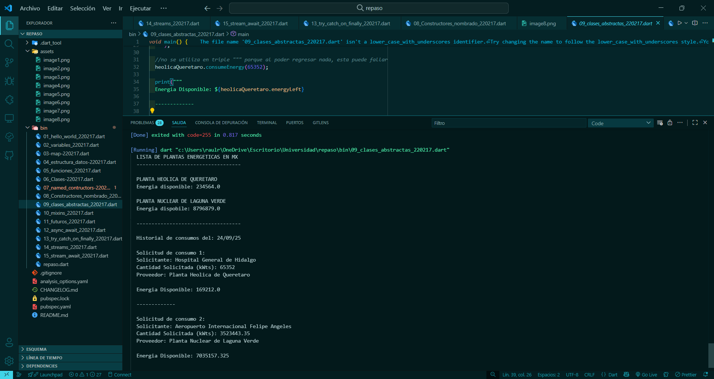

**Conclusión**  
Este ejercicio permitió visualizar cómo se puede generalizar código y forzar la implementación en las clases hijas.

---

### 📝 10_mixins_220217.dart
**Objetivo**  
Aprender el uso de `mixins` en Dart para compartir comportamientos.

**Desarrollo**  
Se crean `mixins` que añaden métodos a una clase sin necesidad de herencia directa.

**Evidencia**  
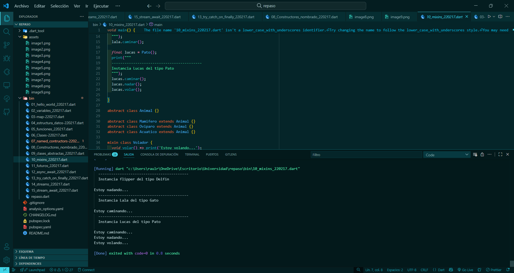

**Conclusión**  
El ejercicio mostró cómo reutilizar funcionalidades en múltiples clases sin romper la jerarquía de herencia.

---
### 📝 11_futuros_220217.dart
**Objetivo**  
Introducir los `Future` y la asincronía.

**Desarrollo**  
Se simula una petición con `Future.delayed`, mostrando cómo esperar resultados y manejar errores.

**Evidencia**  
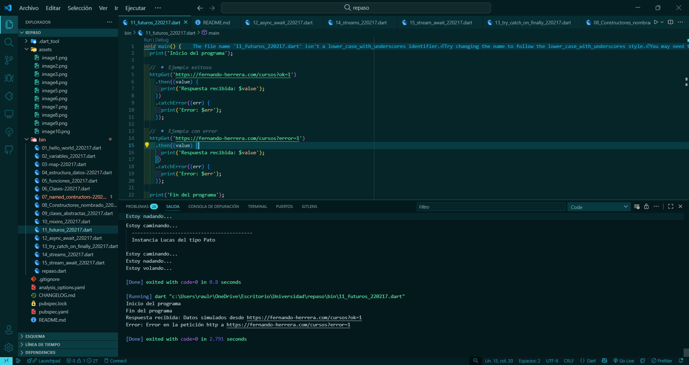

**Conclusión**  
Se entendió cómo Dart maneja operaciones asíncronas.

---

### 📝 12_async_await_220217.dart
**Objetivo**  
Practicar `async` y `await`.

**Desarrollo**  
Se simplifica el manejo de `Future` con sintaxis similar a código síncrono.

**Evidencia**  
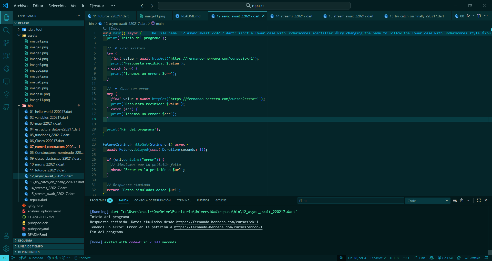

**Conclusión**  
`async/await` mejora la legibilidad y control del flujo.

---

### 📝 13_try_catch_on_finally_220217.dart
**Objetivo**  
Manejar errores con `try`, `catch`, `on` y `finally`.

**Desarrollo**  
Se prueban excepciones controladas y genéricas, cerrando con `finally`.

**Evidencia**  
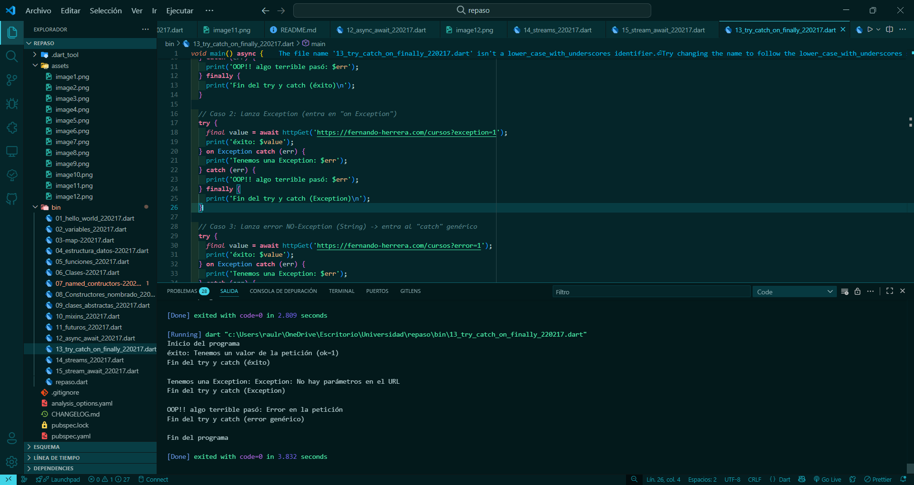

**Conclusión**  
Se reforzó la importancia del manejo de errores.

---

### 📝 14_streams_220217.dart
**Objetivo**  
Comprender `Stream` y emisión de datos.

**Desarrollo**  
Se genera un `Stream.periodic` que emite valores cada segundo y se limita con `.take()`.

**Evidencia**  
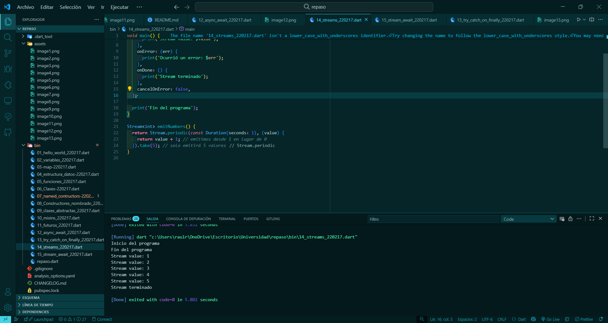

**Conclusión**  
Los streams permiten manejar flujos continuos de datos.

---

### 📝 15_stream_await_220217.dart
**Objetivo**  
Escuchar streams con `await for`.

**Desarrollo**  
Se consume un stream dentro de un bloque asíncrono, usando `await for`.

**Evidencia**  
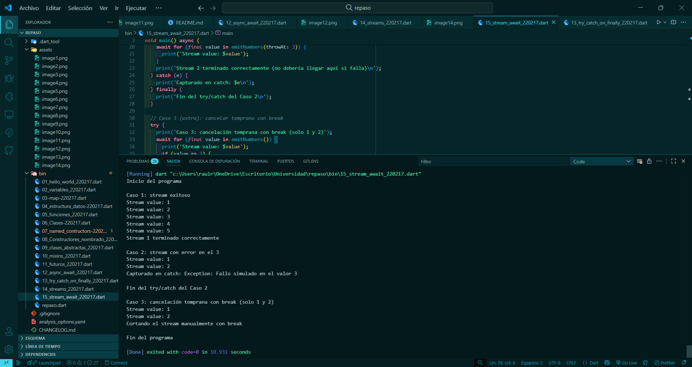

**Conclusión**  
La sintaxis con `await for` facilita el manejo secuencial de datos emitidos.

---

## Conclusiones Generales
La práctica permitió pasar de conceptos básicos a avanzados en Dart, explorando POO, constructores, herencia, mixins, asincronía con `Future` y `async/await`, así como el manejo de `Stream`.  
Esto proporciona una base sólida para el desarrollo de aplicaciones en Flutter y la construcción de programas robustos y eficientes.